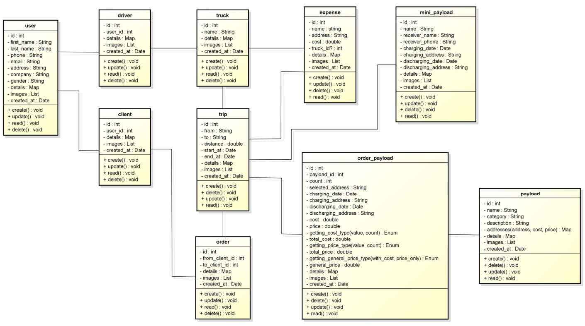

# Beda3a (Version 2)

A new Flutter project for Beda3a App this version uses sqlite to manage and store data.

  

# Whats new

- I create new stricture to manage database easy and useful in `lib/src/utils/database`:
  - `database/database.dart`: initialize tha app database.
  - `database/migration.dart`: create tables with easy way.
  - `database/column.dart`: create table column with any type.
  - `database/column_type.dart`: used to set column type.
  - `database/where_query`: used to create where condition when searching.
    - `where_query/where_query.dart`: collect all files and export it.
    - `where_query/where_query_item.dart`: where condition item.
    - `where_query/where_query_condition.dart`: where conditions types.
    - `where_query/where_query_merge.dart`: merge types (and, or) to merge conditions.
  - `database/model.dart`: create table manager to insert, update and delete data.
  - `database/collections.dart`: manage table items (rows) (save, update, delete).

# Diagram:

  

